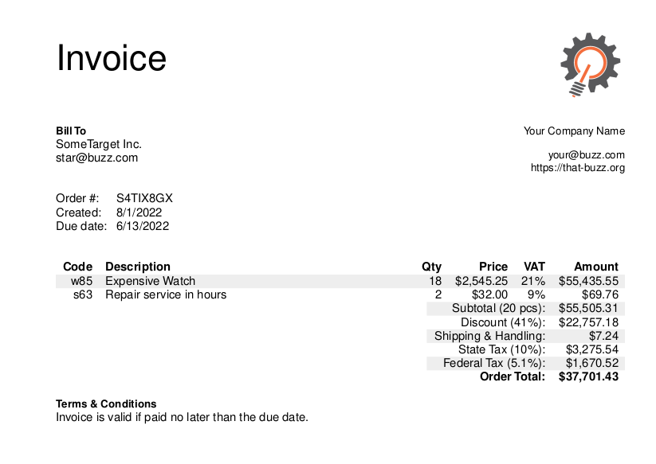

# Invoice-pdfkit

## Business document generator

- License: MIT License
- Author: Matteljay
- Language: JavaScript with TypeScript definitions
- IDE: Visual Studio Code
- Homepage: https://libersystems.com

## Table of contents

- [About](#About)
- [Example](#Example)
- [Features](#features)
- [Donation](#donation)
- [Translation](#translation)
- [Notes](#notes)

## About

_invoice-pdfkit_ attempts to standardize and internationalize the creation of common business pdf documents. Retail articles and hourly job declarations often require documents such as: invoice, receipt, return checklist and refund proofs. Those can now be generated from three simple JavaScript objects: _company_, _order_ and _payment_, all very flexible with optional fields. Traditional bank transfer and cryptocurrency transactions on all layers are supported. Total amounts and optional tax compliance such as VAT and sales taxes are automatically calculated from your list of prices.

### Example

Generated minimal example pdf:


Install this module in your project folder:
`npm i invoice-pdfkit`

Minimal code example:

```js
const tradePDF = require("invoice-pdfkit");
const fs = require("fs");

console.log("Language options: " + tradePDF.getLanguages());
tradePDF.init({
  logo: fs.readFileSync("test/logo.jpg"),
  company: {
    company: "Your Company Name",
    email: "your@buzz.com",
    web: "https://that-buzz.org",
  },
  currency: "USD",
});

const pdfData = tradePDF.invoice({
  id: "S4TIX8GX",
  date: {
    created: 1659372135311,
    due: 1655118412147,
  },
  bill: {
    company: "SomeTarget Inc.",
    email: "star@buzz.com",
  },
  items: [
    {
      id: "w85",
      desc: "Expensive Watch",
      tax: "21",
      qty: "18",
      price: "2545.25",
    },
    {
      id: "s63",
      desc: "Repair service in hours",
      tax: "9",
      qty: "2",
      price: "32.0",
    },
  ],
  total: {
    discount: 41,
    stateTax: 10,
    fedTax: 5.1,
    ship: 7.24,
  },
});
fs.writeFileSync("simple.pdf", pdfData);
console.log("Generated simple.pdf");
```

More complete examples with PDF output are available in [test/](test/).
If you clone this repo, `npm run tsstart` will regenerate the example files.

### Features

- Easy to translate for your language, see the [locales/](locales/) folder.
- Can be used to declare working hours as well as a list of articles and their prices.
- Total price is automatically calculated, factoring in several price inputs.
- Common types of VAT and sales tax fields are supported.
- Exchange rate specification for final payment in a different currency (such as bitcoin) is supported.
- QR-code support for both legacy bank transfers and crypto payments, especially useful for the long address payload of bitcoin lightning network invoices.
- The memo field is used for some cryptocurrencies, payment reference or a note is used for bank transfers.
- Short-form human readable crypto addresses such as Ethereum's ENS can be specified in either the _company_ or _payment_ object at the same location as the bank account number or IBAN/SEPA number.
- A list of all supported fields can be found in the [types/](types/) folder. TypeScript support is optional.

### Donation

This software is free as in transparent, open source and can be used per MIT license. Not free as in zero cost, 1000 lines of code didn't grow on a tree. Advertisements aren't integrated either. Buy the writer a coffee or whatever you consider reasonable if you decide to use it in the current or modified state. Further details in [CONTACT.md](CONTACT.md).

### Translation

Currently supported languages:

- English (GB, US, CA, AU, ...)
- Dutch (NL and Flanders BE)
- German (DE, AT, CH)

To add your language, go to the [locales/](locales/) folder and create a folder specific to your language with a _translation.json_ inside. After forking and editing, feel free to create a Git pull request. Don't forget to add your language to this [README.md](README.md) as well.

### Notes

Some fields may be missing for your region. For example: most dutch entrepreneurs are forced to register a "KvK" number. Simply add that text in the `company.registration` field: **KvK 0441.956.713**. Australian banks may require a "BSB" number for payments. Simply add that text to `payment.bankID` or `company.bankID`: **BSB 033-548**. If you still feel some essential fields are missing, a Git pull request is welcome.

The source code includes a reasonibly advanced flex-table implementation for pdfkit, see the module [src/flex-table.js](src/flex-table.js) this may be used in your own projects.
